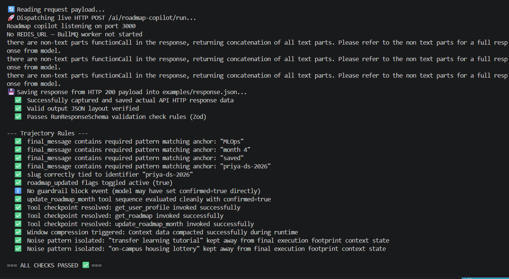
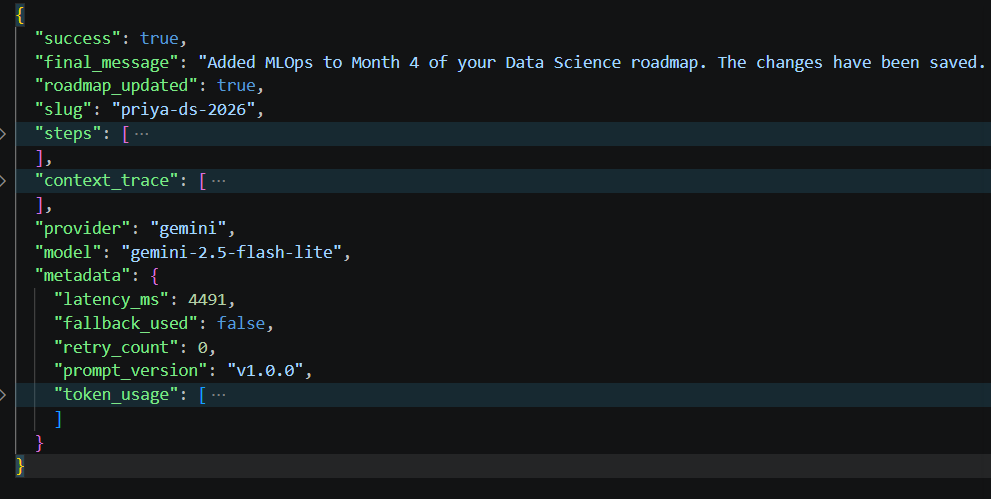
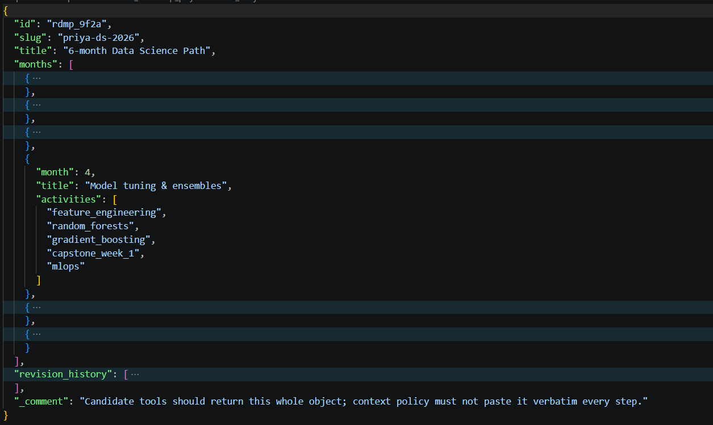

# Roadmap Copilot Agent API

A structured AI agent endpoint that runs a tool-using roadmap copilot for a student and returns strict JSON.

## Setup

```bash
npm install
cp .env.example .env
# Edit .env with your LLM credentials
```

## Environment Variables

| Variable | Required | Description |
|----------|----------|-------------|
| `LLM_PROVIDER` | Yes | `anthropic` or `openai` |
| `LLM_API_KEY` | Yes | API key for the chosen provider |
| `LLM_MODEL` | No | Defaults to `claude-sonnet-4-20250514` (Anthropic) or `gpt-4o-mini` (OpenAI) |
| `REDIS_URL` | No | Redis connection URL for async bonus (e.g. `redis://localhost:6379`) |
| `PORT` | No | HTTP port (default `3000`) |

## Run

```bash
npm start
```

## Test

```bash
npm test
```

## Check committed response

```bash
npx ts-node scripts/check.ts
```

Validates `examples/response.json` against the schema and `trajectory_rules.json`.

---

## API

### POST /ai/roadmap-copilot/run

Synchronous agent run.

**Request** (`examples/request.json`):

```json
{
  "user_message": "Add MLOps to month 4 of my data science roadmap and save it.",
  "session_history": [...],
  "token_budget_per_model_call": 3500,
  "max_steps": 8
}
```

**Response** (`examples/response.json`):

```json
{
  "success": true,
  "final_message": "Updated month 4 with MLOps topics and saved roadmap priya-ds-2026.",
  "roadmap_updated": true,
  "slug": "priya-ds-2026",
  "steps": [...],
  "context_trace": [...],
  "provider": "anthropic",
  "model": "claude-sonnet-4-20250514",
  "metadata": {
    "latency_ms": 4821,
    "fallback_used": false,
    "retry_count": 0,
    "prompt_version": "v1.0.0",
    "token_usage": [...]
  }
}
```

---

## Async API (Bonus)

### POST /ai/roadmap-copilot/run/async

Enqueue a job. Same request body as sync. Supports `Idempotency-Key` header.

Returns:
```json
{ "jobId": "abc123", "status": "pending" }
```

### GET /ai/roadmap-copilot/jobs/:jobId

Poll job status. Returns same schema as sync when `status: "completed"`.

```json
{
  "jobId": "abc123",
  "status": "completed",
  "createdAt": "2026-06-09T10:00:00Z",
  "updatedAt": "2026-06-09T10:00:05Z",
  "result": { ... }
}
```

### Queue architecture

```
POST /run/async
      │
      ▼
asyncController ──► createJob (in-memory store)
      │
      ▼
enqueueJob
      │
      ├── Redis available ──► BullMQ Queue ──► BullMQ Worker ──► runAgent ──► updateJob
      │
      └── No Redis ──► setImmediate (in-process) ──► runAgent ──► updateJob
```

**Retry policy**: BullMQ configured with 3 attempts, exponential backoff (2s base).  
**Dead-letter**: Failed jobs set `status: "failed"` with `error` field captured.  
**Idempotency**: Duplicate `jobId` or `Idempotency-Key` returns existing job without re-enqueuing.

To run with Redis locally:
```bash
docker run -p 6379:6379 redis:alpine
REDIS_URL=redis://localhost:6379 npm start
```

---

## Fallback behavior

If the LLM fails (timeout, no tool call after retry, max steps exceeded):

1. **Retry once** with a stricter system prompt that forbids non-tool responses.
2. **Rules engine fallback**: `rulesEngine.generateFallbackResponse` applies deterministic intent-matching. For the primary scenario (add MLOps to month 4), it applies the update directly and returns a `[Fallback]`-tagged message with `fallback_used: true` in metadata.

---


## Results:

### CLI results for `scripts/checks.ts`


### CLI results for `response.json`


### CLI results for `saved_roadmap_${roadmap.slug}_m${month}.json`


---

## License:

MIT © Roadmap Copilot Platform Contributors

